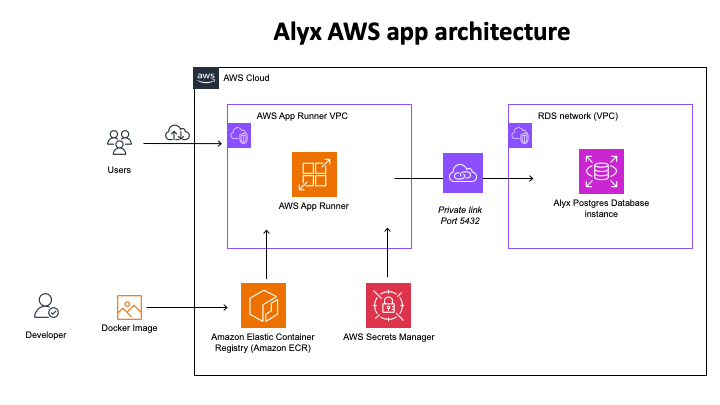

# Alyx webapp deployment guide

We are going to deploy the Alyx webapp on AWS using Docker.

We will ship a Django/Alyx container to AWS app runner. 
The container is configured to run with a postgres database is hosted on AWS RDS.
The application is configured to provide secrets to the container and connects to the database through a virtual private network.

To deploy a new version of Alyx, a developer has to:
- build the docker image on `mbox`
- push the newly built image to the AWS container registry
- trigger the application build (we can set this to automatic)

## Update the code: build the container

### Command to build the container
On mbox, cd to the `iblalyx` repository.

    cd ./deployment
    sudo docker buildx build ./ \
        --platform linux/amd64 \
        --tag public.ecr.aws/p4h6o9n8/alyx:latest \
        --build-arg DATETIME=$(date +%Y-%m-%d-%H:%M:%S)

The buildx command is used to make sure the image is built for the right architecture (linux/amd64), even if the build is done on a different architecture (e.g. macOS).
The `buildrunlocal.sh` script is provided as a shortcut to build and run the container locally to test it before launching. The container will be available at `localhost:8000`, and connects to the production database.

### Pushing the container to ECR

I have included the login command, but it is unclear how often this needs refreshing.

    aws --profile ucl ecr-public get-login-password --region us-east-1 | docker login --username AWS --password-stdin public.ecr.aws/p4h6o9n8   
    docker push public.ecr.aws/p4h6o9n8/alyx:latest

### Deploying the container on App Runner

It is a good practice to make sure version number is updated between deployments, as it is easier to see when the website has updated.
Login to AWS and go to the App Runner service. Select `alyx-prod` and hit `Deploy`.
The deployment should take a few minutes.

## Creating a service on App Runner
[This resource](https://aws.amazon.com/blogs/containers/deploy-and-scale-django-applications-on-aws-app-runner/
) is useful as a starting point, especially to configure the VPC between the app and the postgres service.

For configuring the app, the environment variables in `environment_template.env` need to be set for the app configuration.
The `DATABASE_SECRET` key is provided through an AWS secret.

A custom webdomain can be setup once the app is deployed by updating DNS records for the specified subdomain.
The SSL certificates are handled automatically as part of the service.

## Description of the Dockerfile

The Dockerfile is based of a python 3.11 image and pulls the latest version of Alyx from the github repository.

Additional packages installed are:
- tools to build the `pyscopg2` package, which is required to connect to the postgres database
- `gunicorn` a pip package that provides low configuration webserver for django that replaces apache
- `whitenoise` a pip package to serve static files
- `dj-database-url` a pip package that converts the `DATABASE_SECRET` URL to django `DATABASES` settings.

The settings files are provided in this repository and copied into the image at build time. **Neither settings files nor the docker image contains sensitive information**, all passwords and secrets are provided at runtime.

One can run the container locally to test it.
For this to run properly, you need to define the environment variables in the `environment.env` file. You can use the `environment_template.env` file as a template.

    cd ./deploymentdeployment

    docker run  \
        --env-file environment.env \
        --platform linux/amd64 \
        -p 8000:8000 \
        public.ecr.aws/p4h6o9n8/alyx:latest
